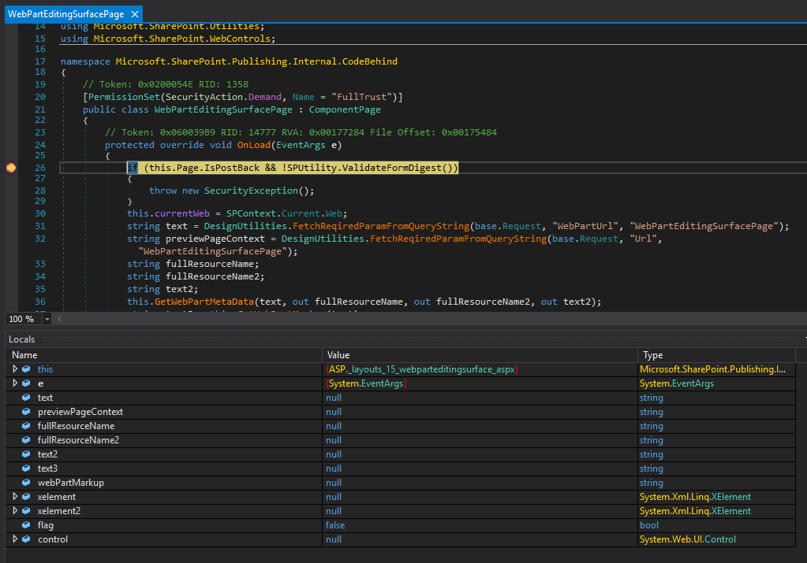

# nojit

This tool aids in auditing .net c# code by creating configuration files for each identified assembly that specifies the code to not be jitted. 

## How

1. Open dnspy and attach to target process
2. From the navigation window: Debug->Windows->Modules
3. Highlight all modules in the window and right click -> copy
4. Paste your clipboard buffer into modules.txt
5. run nojit.ps1 as admin

This is important when debugging with dnspy so that we can see all variables, something to this effect:

